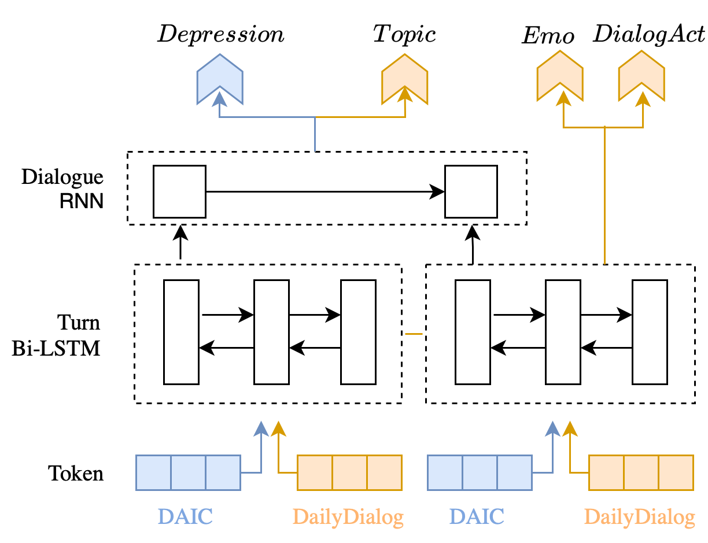

# Multi-Task Learning for Depression Detection in Dialogs

This is the source code repository for the paper Multi-Task Learning for Depression Detection in Dialogs (SIGDial 2022).



## Requirements
- allennlp >= 2.0
- pytorch
- numpy


## Datasets
### DAIC-WOZ
Our main task depression detection uses DAIC-WOZ (part of the Distress Analysis Interview Corpus) (Gratch et al.,2014). 
We show one example in `data/daic/`. Download the whole dataset is available [here](https://dcapswoz.ict.usc.edu).

### DailyDialog
Our auxiliary tasks use Dailydialog (Li et al., 2017). 
We show a few examples in `data/dailydialog/`. We use the original separation of train, validation, and test. Download from [here](http://yanran.li/dailydialog.html).

## Source code

- `main.py`: choose MODE for train and test, modify arguments for different multi-task settings. We also provide a pretrained model in repo `model/`
- `model.py`: hierarchical structure modeling
- `dataset_reader.py`: read daic-woz and dailydialog
- `utility.py`: store auxiliary functions
- `constant.py`: store hard-coded paths, labels, etc.

## Dialog act annotation

We provide annotation of dialog act for Ellie's utterances in DAIC (repo `analysis/`). Note that it's a corase-grained annotation with 5 classes: *question*, *opening*, *comment*, *backchannel*, *other*. 

## Citation
```
@inproceedings{li2022multi,
  title={Multi-Task Learning for Depression Detection in Dialogs},
  author={Li, Chuyuan and Braud, Chlo{\'e} and Amblard, Maxime},
  booktitle={SIGDIAL 2022-The 23rd Annual Meeting of the Special Interest Group on Discourse and Dialogue},
  year={2022}
}
```